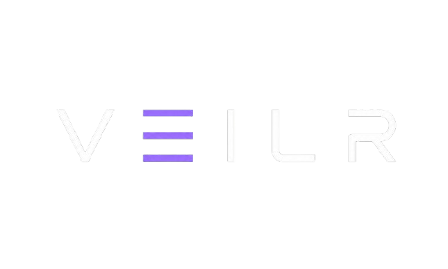
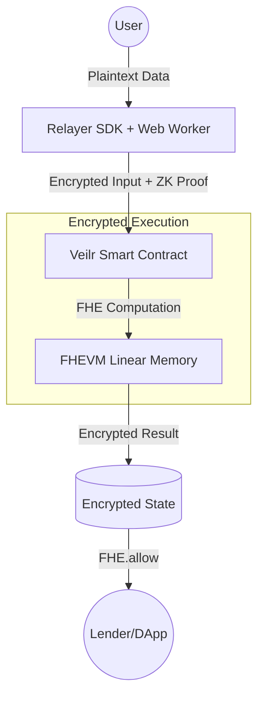

<div align="center">
  
  <h1>The Private Reputation Layer for Decentralized Finance</h1>
  <p><b>Bridging the gap between radical transparency and absolute financial privacy using FHE.</b></p>
  
  [](https://sepolia.etherscan.io/)
  [](https://zama.ai/fhevm)
  [](https://docs.zama.ai/)
</div>

---

## 💡 The Problem: Radical Transparency
Web3 has a privacy problem. To prove you are a "good borrower" or a "trusted actor," you currently have to expose your entire wallet history, balances, and financial behavior to the public. This **radical transparency** is the primary barrier preventing institutional and retail adoption of private DeFi.

## 🛡️ The Solution: Veilr
**Veilr** is a privacy-first infrastructure layer built on **Zama's FHEVM**. It allows users to generate and prove their financial reputation without ever revealing their underlying data. 

By leveraging **Fully Homomorphic Encryption (FHE)**, Veilr enables smart contracts to perform complex credit scoring and transfers entirely in ciphertext. The data is never decrypted on-chain, yet the results are verifiable and actionable.

---

## 🏗️ Protocol Architecture

Veilr operates as a multi-layer privacy stack:

### 1. Private Transfer Layer (Remittance)
- **Zero Trail**: Amounts and recipients are hidden behind FHE ciphertexts.
- **Selection Anonymity**: Uses homomorphic matching to update balances without leaking which user received funds.
- **Off-Thread Encryption**: High-performance encryption using Web Workers (WASM) to keep the UI responsive.

### 2. Private Credit Scoring (Reputation)
- **Weighted Signals**: Computes tiers (1, 2, or 3) based on wallet age, transaction frequency, and multi-token liquidity.
- **Ciphertext Logic**: All scoring logic (e.g., `FHE.ge`, `FHE.select`) runs inside the FHEVM.
- **Selective Disclosure**: Using `FHE.allow()`, results are only visible to the applicant and the authorized lender.

### 3. Threshold Audit (Compliance)
- **Privacy + Accountability**: A multi-sig governance layer for compliance.
- **Collective Decryption**: Requires 2/2 signatures from authorized auditors to reveal encrypted transaction details for AML/KYC purposes.

---

## 📊 Technical Flow (FHE)



---

## 🚀 Technical Highlights

### ⚡ Performance: Off-Thread FHE Encryption
FHE encryption is computationally expensive. Veilr solves the "Main Thread Freeze" problem by offloading all cryptographic WASM operations to **Web Workers**. This ensures the DApp remains at 60fps even during complex ciphertext generation.

### 🔒 Privacy-First Credit Signals
Veilr doesn't just store balances; it computes over them.
```solidity
// Example: Encrypted activity check
ebool isTier1 = FHE.and(
    FHE.ge(count1000, uint8(3)), // Has at least 3 high-value balances
    FHE.ge(vActivity, uint64(10)) // Has at least 10 interactions
);
```

---

## 🛠️ Developer Integration

Veilr is built as an infrastructure layer. Other protocols can verify a user's credit tier with a single interface call:

```solidity
import "./IVeilrCredit.sol";

contract MockLender {
    IVeilrCredit public veilr;

    function assessBorrower(address borrower) external {
        // Request the encrypted credit tier
        // Only this contract will be allowed to see the result
        euint8 tier = veilr.requestCreditTier(borrower, address(this));
        
        // Compute logic privately on the tier
        ebool isTrusted = FHE.le(tier, uint8(2));
        // ...
    }
}
```

---

## 🧪 Judging & Testing Guide

To verify the FHE integration, follow these steps:

1.  **Wallet Connection**: Use MetaMask on Sepolia. The DApp will automatically handle the network switch.
2.  **Encrypted Minting**: Click "Deposit Test cUSDT" on the Dashboard. This mints 1000 tokens using `FHE.asEuint64`.
3.  **Encrypted Balance Decryption**: Sign the EIP-712 request. This uses Zama's re-encryption logic to safely decrypt your private balance in the browser.
4.  **Private Send**: Navigate to the "Send" page. Enter a recipient and amount. The DApp will generate a ZK Input Proof off-thread (using Web Workers) and submit the ciphertext.
5.  **Verify Privacy**: Check the transaction on Sepolia Etherscan. You will notice that the `amount` and `recipient` parameters are encrypted handles, not plaintext.

---

## 📦 Getting Started


### Prerequisites
- Node.js v20+
- Metamask (Connected to Sepolia)

### 1. Installation
```bash
# Clone the repository
git clone https://github.com/your-repo/veilr
cd veilr

# Install root dependencies
npm install

# Install frontend dependencies
cd frontend && npm install
```

### 2. Deployment
Configure your `.env` with your `PRIVATE_KEY` and `SEPOLIA_RPC_URL`.
```bash
npx hardhat compile
npx hardhat run scripts/deploy.ts --network sepolia
```

### 3. Development
```bash
cd frontend
npm run dev
```

---

## 🛣️ Roadmap
- [x] **Phase 1**: Core FHEVM Transfer & Credit Scoring.
- [x] **Phase 2**: Relayer SDK Integration & Web Worker Optimization.
- [ ] **Phase 3**: Private Lending Pool Integration (Layer 3).
- [ ] **Phase 4**: Cross-chain reputation signals using FHE proofs.

