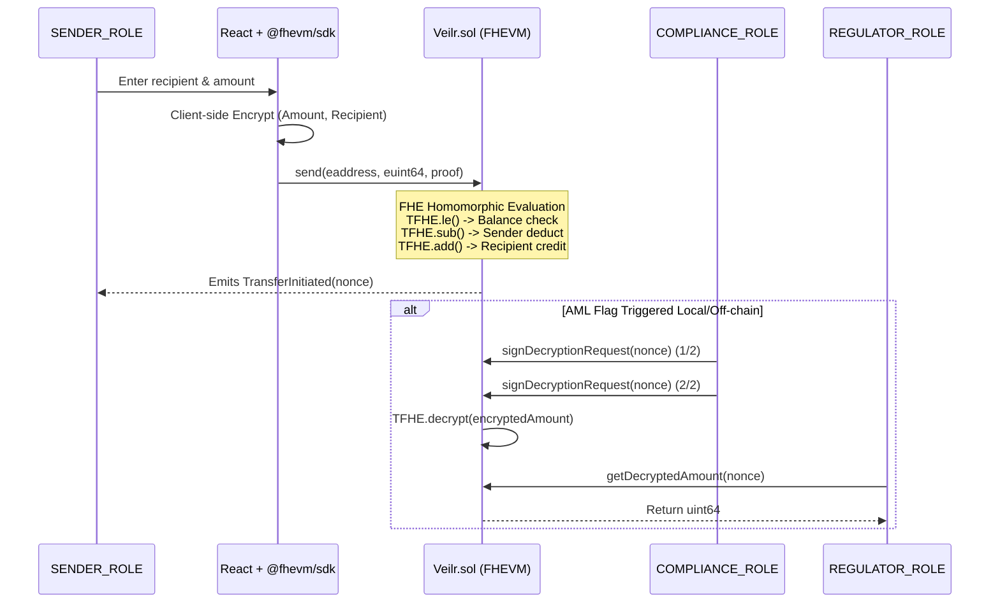

# Veilr - Confidential Cross-Border Remittance

**A Fully Homomorphic Encryption (FHE) powered dApp for private international transfers.**

## Project Overview

In today's Web3 landscape, all transaction amounts and recipient addresses are public on-chain by default. For the $50B/year cross-border remittance market—particularly the African diaspora sending money home to Nigeria, Ghana, and Kenya—this lack of financial privacy is a major barrier to adoption. No one wants their entire salary, savings, and remittance history visible to the public. 

**Veilr** solves this by leveraging the Zama Protocol FHEVM. Senders can transfer `cUSDT` (Encrypted USDT) internationally where the amount and recipient address remain completely encrypted on-chain. The public blockchain only sees that a generic transaction occurred via nonces. At the same time, we've implemented a robust compliance layer: to satisfy AML/KYC regulations, a strictly controlled multi-sig process allows verified Compliance Officers to approve threshold decryptions for flagged transactions. 

## Architecture Diagram



## How FHE is Used

Veilr natively uses Fully Homomorphic Encryption so that smart contracts can compute over encrypted data without ever decrypting it.
- **`euint64` and `eaddress`**: Instead of standard `uint64` balances and `address` targets, our contract state uses encrypted types. Computations are done using `TFHE.add` and `TFHE.sub`.
- **Anonymity via Homomorphic Selection**: To prevent leaking the recipient's identity through state, the transfer loops over an array of registered users and securely evaluates `TFHE.select(TFHE.eq(encryptedRecipient, user), transferAmount, 0)`.
- **`TFHE.allow()`**: Ensures only specific parties (or the contract itself) can hold permissions to decrypt or interact with specific ciphertexts in the future.

## Compliance Design Decision

Privacy is a fundamental right, but unconditional financial opacity enables bad actors, which prevents real-world adoption in regulated markets. **Threshold Decryption via Multi-sig** represents the perfect middle ground. 

By ensuring amounts remain encrypted by default, normal users maintain total financial privacy. However, if an off-chain heuristic flags a transaction nonce as potentially violating Anti-Money Laundering (AML) controls, `COMPLIANCE_ROLE` members can act. By requiring a 2-of-2 (or M-of-N) signature scheme, we ensure no single entity can abuse decryption powers. Once co-signed, the contract unwraps the ciphertext specifically for the `REGULATOR_ROLE`, satisfying legal requests without compromising the entire protocol's privacy properties.

## Getting Started Locally

### 1. Install Dependencies
```bash
# Root dependencies (Hardhat + FHEVM Solidity)
npm install

# Frontend dependencies
cd frontend
npm install
```

### 2. Run Tests
Ensure you have local FHEVM bindings or run the mock test suite.
```bash
npx hardhat test
```

### 3. Deploy to Zama Protocol Sepolia Testnet
Configure your `PRIVATE_KEY` in a `.env` file at the root.
```bash
npx hardhat run scripts/deploy.ts --network zama
```

### 4. Run Frontend
```bash
cd frontend
npm run dev
```

## Deployed Contract

- **Network:** Zama Protocol Sepolia Testnet (Chain ID 9000)
- **Contract Address:** *To be deployed*
