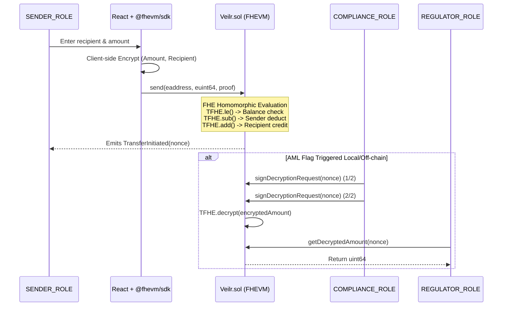

# Veilr - Confidential Cross-Border Remittance

**A Fully Homomorphic Encryption (FHE) powered dApp for private international transfers.**

## Project Overview

In today's Web3 landscape, all transaction amounts and recipient addresses are public on-chain by default. For the $50B/year cross-border remittance market—particularly the African diaspora sending money home to Nigeria, Ghana, and Kenya—this lack of financial privacy is a major barrier to adoption. No one wants their entire salary, savings, and remittance history visible to the public. 

**Veilr** solves this by leveraging the Zama Protocol FHEVM. Senders can transfer `cUSDT` (Encrypted USDT) internationally where the amount and recipient address remain completely encrypted on-chain. The public blockchain only sees that a generic transaction occurred via nonces. At the same time, we've implemented a robust compliance layer: to satisfy AML/KYC regulations, a strictly controlled multi-sig process allows verified Compliance Officers to approve threshold decryptions for flagged transactions. 

## Architecture Diagram



## How FHE is Used

Veilr natively uses Fully Homomorphic Encryption so that smart contracts can compute over encrypted data without ever decrypting it.
- **`euint64` and `eaddress`**: Instead of standard `uint64` balances and `address` targets, our contract state uses encrypted types. Computations are done using `TFHE.add` and `TFHE.sub`.
- **Anonymity via Homomorphic Selection**: To prevent leaking the recipient's identity through state, the transfer loops over an array of registered users and securely evaluates `TFHE.select(TFHE.eq(encryptedRecipient, user), transferAmount, 0)`.
- **`TFHE.allow()`**: Ensures only specific parties (or the contract itself) can hold permissions to decrypt or interact with specific ciphertexts in the future.

## Compliance Design Decision

Privacy is a fundamental right, but unconditional financial opacity enables bad actors, which prevents real-world adoption in regulated markets. **Threshold Decryption via Multi-sig** represents the perfect middle ground. 

By ensuring amounts remain encrypted by default, normal users maintain total financial privacy. However, if an off-chain heuristic flags a transaction nonce as potentially violating Anti-Money Laundering (AML) controls, `COMPLIANCE_ROLE` members can act. By requiring a 2-of-2 (or M-of-N) signature scheme, we ensure no single entity can abuse decryption powers. Once co-signed, the contract unwraps the ciphertext specifically for the `REGULATOR_ROLE`, satisfying legal requests without compromising the entire protocol's privacy properties.

## Getting Started Locally

### 1. Install Dependencies
```bash
# Root dependencies (Hardhat + FHEVM Solidity)
npm install

# Frontend dependencies
cd frontend
npm install
```

### 2. Run Tests
Ensure you have local FHEVM bindings or run the mock test suite.
```bash
npx hardhat test
```

### 3. Deploy to Zama Protocol Sepolia Testnet
Configure your `PRIVATE_KEY` in a `.env` file at the root.
```bash
npx hardhat run scripts/deploy.ts --network zama
```

### 4. Run Frontend
```bash
cd frontend
npm run dev
```

## Deployed Contract

- **Network:** Zama Protocol Sepolia Testnet (Chain ID 9000)
- **Contract Address:** `0x3c76d71c9c12f120B4bb15E8873CBfF5F50baCd2`

---

## Private Credit Scoring

### The Problem
DeFi lending protocols cannot build credit systems because financial history cannot be shared privately on public blockchains. Every wallet balance, transaction amount, and counterparty is permanently visible on-chain. No one will voluntarily submit their financial history — salary, savings habits, or repayment record — to a system where that data is permanently public. This makes on-chain lending primitive: either over-collateralised (you prove you don't need the loan) or based on governance reputation, not real creditworthiness.

### The Solution: FHE Computation on Encrypted Signals
Veilr's Private Credit Scoring module solves this with a simple principle: **the math happens inside a locked box, even the blockchain does not know the inputs.**

A borrower submits four encrypted financial signals:
1. **Average Balance Tier** (1–5) — wealth signal, weight ×3
2. **Transaction Activity** (1–3) — on-chain activity level, weight ×2
3. **Wallet Age** (months) — longevity signal, weight ×2
4. **Repayment History** (0 or 1) — prior loan performance, weight ×3

These four values are **encrypted client-side** in the browser using the Zama FHEVM SDK before any data is sent to the blockchain. The smart contract receives only encrypted ciphertexts. It then computes the weighted score entirely in ciphertext:

```
score = (avgBalance × 3) + (txCount × 2) + (walletAge × 2) + (repaymentFlag × 3)
```

A lender calls `getScoreTier()` and receives an **encrypted tier** (1, 2, or 3) — never the raw score, never the inputs.

### Three-Step User Flow
1. **Submit Signals**: The borrower selects their financial profile using the application form. All four inputs are encrypted inside the browser using `createEncryptedInput()` before the transaction is signed.
2. **FHE Computation**: The smart contract calls `_computeScore()`, which performs the entire weighted sum using `TFHE.mul()` and `TFHE.add()` on ciphertexts. No plaintext ever appears on-chain.
3. **Tier Result Only**: The lender calls `getScoreTier()`, which uses `TFHE.select()` to derive a tier category from the encrypted score. The lender receives only the encrypted tier. After client-side decryption, they see "Tier 1", "Tier 2", or "Tier 3" — nothing else.

### FHE Design Decisions

**Why `TFHE.select()` instead of `if/else`?**
Standard Solidity `if/else` conditions cannot operate on encrypted values — you cannot branch on a secret. `TFHE.le()` returns an encrypted boolean (`ebool`), and `TFHE.select(condition, trueValue, falseValue)` evaluates **both branches homomorphically** and returns one of them, all without revealing which branch was taken. This preserves the secrecy of the score.

**Why does the lender receive a tier, not a raw score?**
Returning the raw encrypted score to a lender would allow them to build a partial model of the borrower's inputs through repeated queries (a "ciphertext oracle" attack). By mapping scores to three discrete tiers using `TFHE.select()`, the information density is drastically reduced — the lender learns only what they need to make a lending decision, and nothing more.

**Why `FHE.allow()` on the result?**
Encrypted values in FHEVM are access-controlled at the protocol level. `FHE.allow(result, lender)` grants the specific lender's address decryption rights for that tier ciphertext. This ensures that even if the encrypted handle is intercepted, only the intended lender can decrypt it through the Zama Gateway.
